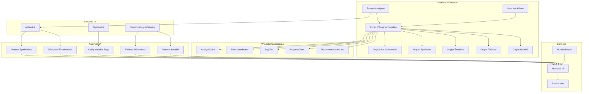
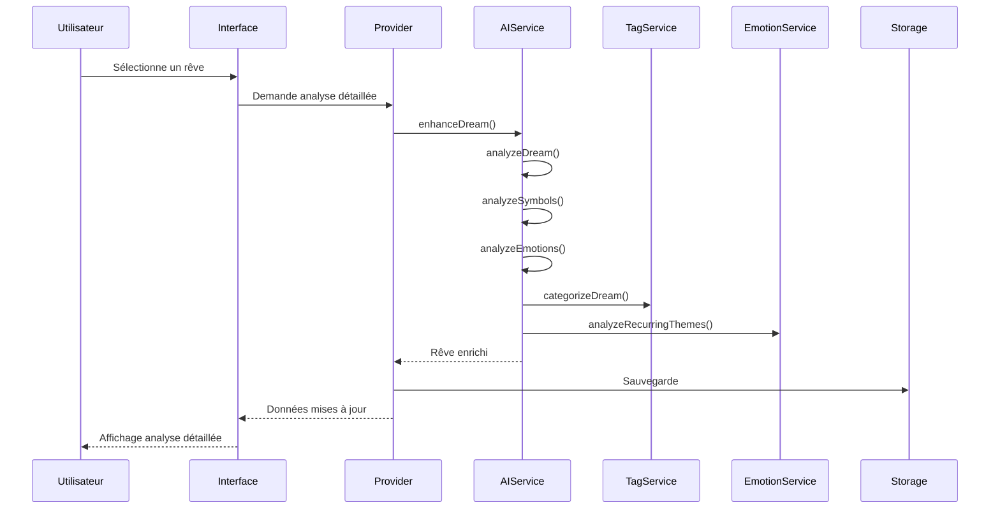
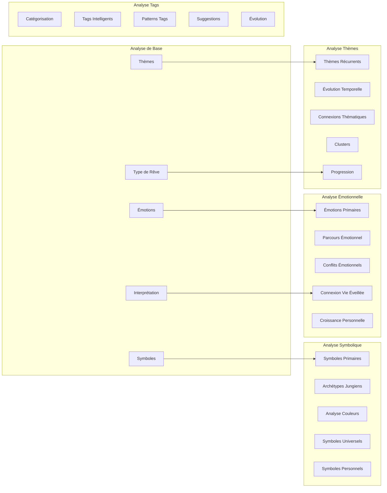

# Architecture Phase 3 - Dream Diary

## Diagramme d'Architecture

## Flux de Données

## Structure des Analyses

## Services et Responsabilités

### AIService (Amélioré)
- **Analyse de base** : Émotions, thèmes, symboles
- **Analyse symbolique** : Jung, Freud, archétypes
- **Analyse émotionnelle** : Détection avancée
- **Thèmes récurrents** : Comparaison historique

### TagService (Nouveau)
- **Catégorisation** : Classification multi-axes
- **Tags intelligents** : Avec contexte
- **Patterns de tags** : Analyse des tendances
- **Suggestions** : Tags manquants

### EmotionAnalysisService (Nouveau)
- **Évolution émotionnelle** : Analyse temporelle
- **Thèmes récurrents** : Détection automatique
- **Patterns de lucidité** : Analyse spécialisée
- **Recommandations** : Conseils personnalisés

## Interface Utilisateur

### Écran d'Analyse Détaillée
- **5 onglets** : Vue d'ensemble, Symboles, Émotions, Thèmes, Lucidité
- **Navigation fluide** : TabController avec animations
- **Widgets réutilisables** : Composants modulaires
- **Actions** : Actualisation, partage, navigation

### Widgets Spécialisés
- **AnalysisCard** : Cartes d'analyse standardisées
- **EmotionIndicator** : Visualisation des émotions
- **TagChip** : Tags interactifs
- **ProgressChart** : Graphiques de progression
- **RecommendationCard** : Cartes de conseils

## Intégration avec Phase 2

### Données Existantes
- **Modèle Dream** : Champ `aiAnalysis` étendu
- **Provider** : Nouvelles méthodes d'analyse
- **Storage** : Compatible avec les données existantes
- **Navigation** : Intégration transparente

### Améliorations
- **Analyses plus riches** : Données structurées
- **Interface améliorée** : Navigation intuitive
- **Performance** : Optimisations IA
- **UX** : Feedback utilisateur

## Prochaines Étapes (Phase 4)

### Visualisations Avancées
- **Graphiques interactifs** : fl_chart
- **Dashboard** : Vue d'ensemble
- **Timeline** : Évolution temporelle
- **Métriques** : KPIs utilisateur

### Optimisations
- **Parsing JSON** : Implémentation réelle
- **Cache** : Optimisation des performances
- **Offline** : Mode déconnecté
- **Sync** : Synchronisation cloud
